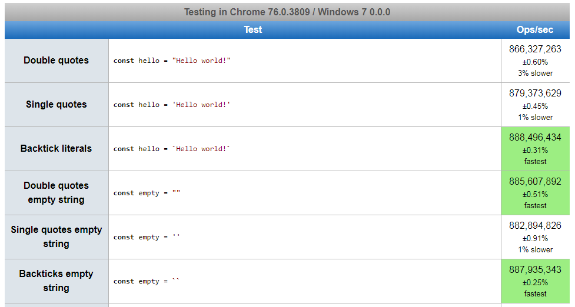

# 오늘의 TMI

Category: #TMI #Javascript

## 1. String 표현식에 성능 차이가 있다?

링크: [원본 포스트](https://medium.com/javascript-in-plain-english/are-backticks-slower-than-other-strings-in-javascript-ce4abf9b9fa)

- 글쓴이가 [jsperf](https://github.com/jsperf/jsperf.com)를 사용해서 성능 비교를 하여 결과를 보여주었다.

1. String을 표현하는 '', "", `` 3가지 방법에서 미묘한 성능 차이가 있다.



2. Empty String을 체크하는 방법들에도 정말 미묘한 성능 차이가 있다.


3. Formatting을 하는 방법에도 미묘한 성능 차이가 있다.


- 여기서 ops/sec는 초당 수행 횟수

### 결론: There’s no need to be picky!

## 2. 보다가 이렇게도 되는구나 했던 코드

```javascript
(2).toString();
// "2"
typeof 2;
// number
```

### 결론: 이렇게 써본 적이 없다 보니 그냥 신기했다.
