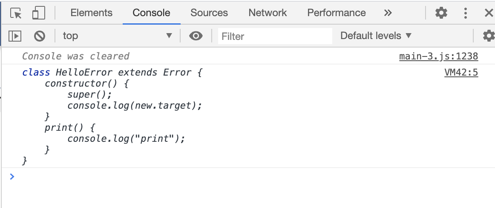

# TypeScript - Extended Error

Category: #Troubleshooting

Automata를 리팩터링하던 도중 Error를 상속한 클래스들에서 `Object.setPrototypeOf`를 사용하는 것을 보았다.

프로젝트를 처음 인계받을 때 setPrototypeOf을 사용하기 위한 Polyfill도 따로 있어서 궁금했고,
이 로직 자체가 왜 쓰이는지 확인을 위해 `Object.setPrototypeOf`를 따로 보고,
`new.target.prototype`을 따로 봐도 이 친구들이 어디 쓰이는지 알 수가 없었다.

그러다 저 문장 자체를 검색해 보기로 했고, StackOverflow에서 [답변](https://stackoverflow.com/questions/41102060/typescript-extending-error-class)을 찾을 수 있었다.

간단하게 요약하면 TypeScript 2.1과 ES5를 transcompile해서 사용하고 있을 때,
TypeScript 안에 내장되어 있는 인터페이스들(ex. Error, Array, Map 등)을 상속받아 사용하게 되면,
원본의 액션이 동작하지 않을 수도 있다고 한다.
문제에 대한 해결책으로 강제로 구현체의 프로토타입을 this로 매핑시키기 위해서 위처럼 문법을 사용했던 것이다.

이 내용은 [TypeScript 2.1 Breaking Changes](https://github.com/Microsoft/TypeScript-wiki/blob/master/Breaking-Changes.md#extending-built-ins-like-error-array-and-map-may-no-longer-work)에 나와있다.

### new.target?

[TypeScript 2.2부터 지원하는 기능](https://www.typescriptlang.org/docs/handbook/release-notes/typescript-2-2.html#support-for-newtarget)으로 앞에 있던 문제를 해결하라고 대놓고 예시로 보여주고 있다.

### 결론

- Error를 상속해서 사용하려면 이 문법을 사용해야 안전하다.
- _TypeScript 2.1부터 계속해서 이어지고 있는 문제.
  해결했다는 문서를 찾아볼 수 없었다. 구현의 한계일까?_
