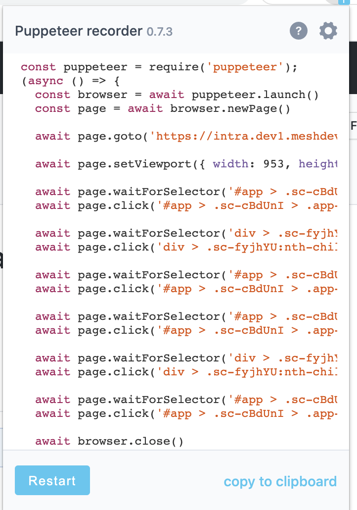
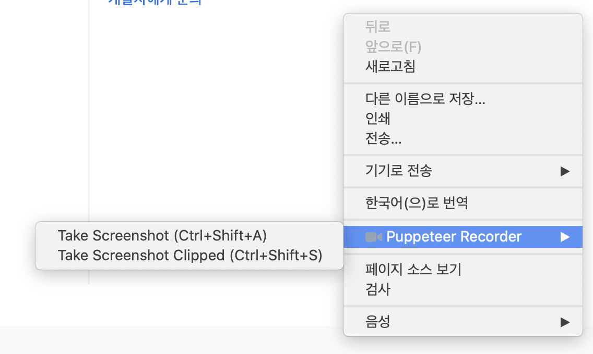

# puppeteer-recorder

Category: #Tech

- [크롬 익스텐션 페이지](https://chrome.google.com/webstore/detail/puppeteer-recorder/djeegiggegleadkkbgopoonhjimgehda)
- 브라우저의 인터랙션을 캡쳐하고 스크립트로 실행할 수 있게 해준다.
- 캡쳐하는 인터랙션 목록
  - Navigate(페이지 이동)
  - Click
  - KeyDown
  - Viewport(리사이즈)

## 장점

- 이슈 재현을 캡쳐된 스크립트를 실행해서 동일하게 진행해볼 수 있다.(QA에 도입된다면 좋을만한 기능)

  

- 페이지에서 우클릭을 하면 화면을 바로 캡쳐할 수 있는 기능이 있다.

  

## 단점

- 스크립트가 캡쳐한 모든 인터랙션을 옮겨주진 않았다. 특히 KeyDown 이벤트는 캡쳐만 되고 스크립트로는 옮겨지지 않았다.(컴퓨터 문제일수도?)
- CSR에 대한 지원이 미흡하다.
  - Navigate 이벤트를 전혀 감지하지 못한다.
  - window 이벤트 기반으로만 캡쳐하는 듯

## 총평

- 메쉬원과 같은 CSR에 도입하기에는 무리가 있어보인다.
- 버전 업데이트를 좀 더 지켜봐야 할 듯.
- 노드 기반에서 동작하는 [Recoder](https://github.com/puppeteer/recorder)도 존재한다. 아직 개발중인 상황
