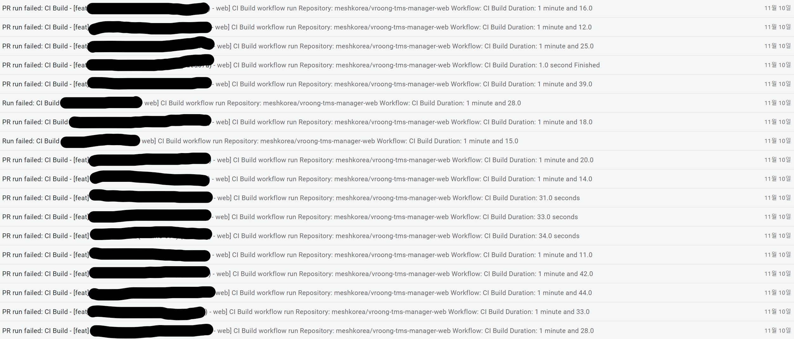

# yarnrc, npmrc 이슈(1)

Category: #Troubleshooting

외부 private 라이브러리를 쓸 일이 생겨, 회사의 제품에 라이브러리를 추가하기 위해 총 3곳에 private 저장소의 설정을 추가하고 문서화를 진행했다.

1. 회사에서 일할 때 사용하는 컴퓨터
2. PR 검증용 Github Actions 빌드
3. 실배포용 CI/CD 툴 빌드

개인적으로 사용하는 컴퓨터에는 토큰을 홈 디렉터리의 `.npmrc`에 저장해서 사용했었다.

하지만 Github Actions와 CI/CD 툴에 직접적으로 저장소 토큰을 노출시키는 것은 위험성이 있어 Secrets과 같은 위치에 저장한 다음, 빌드 스크립트에서

`yarn config set {auth_token} {secret}`

와 같이 세팅을 한 뒤 라이브러리를 설치하는 절차로 진행했다.
그러다 작업용 컴퓨터를 제외한 나머지 외부 빌드에서 문제가 생겼는데, 저장소에 접근하지 못하고 있었다.

먼저 문제가 발생한 경우는 이러했다.

```shell
// previous setting

// 레지스트리 세팅은 프로젝트 최상위의 .yarnrc에 들어있다
yarn config set //alpha.beta.gamma/:_authToken {auth_token}

// Install dependencies...
```

정상적으로 registry와 auth token을 설정해줬는데, 401 오류를 주면서 계속 빌드 오류가 났고, token에 문제가 있는지 아니면 스크립트상 문제가 있는지 계속 수정하면서 빌드를 시도했지만 모두 실패했었다.


_무수한 빌드 실패의 현장_

그렇게 해결책을 팀원과 같이 찾다가 yarn이 아닌 npm에 config을 적용해보았다.

```
// previous setting

// 레지스트리 세팅은 프로젝트 최상위의 .yarnrc에 들어있다
npm config set //alpha.beta.gamma/:_authToken {auth_token}

// Install dependencies...
```

된다. 왜?

왜 되는지 충격을 받아서 이것저것 시도를 해봤는데, 패키지 매니저로 yarn을 사용해서 라이브러리를 설치하더라도 yarnrc와 npmrc중에 npmrc를 먼저 참조하는 경우가 있었다.

이 상황이 우선순위 이슈인지 더 확인해봐야 할 것 같아, 내일은 직접 config을 건드려보면서 우선순위를 정리해보려 한다.
