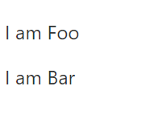

# Svelte(2) - 튜토리얼 따라하기

Category: #Tech

Svelte를 시작하려면? [링크](https://svelte.dev/tutorial/basics)

---

### 기본적인 Svelte 파일 구성

```svelte
<script>
  const name = "Park";
</script>

<style>
  h1 {
    color: blue;
    font-size: 30px;
  }
</style>

<h1>Hello {name}</h1>
```


---

### 외부 모듈 사용

```
<!-- 주석은 이렇게 사용한다. -->
<!-- Foo.svelte -->
<p>I am Foo</p>
```

```
<!-- Bar.svelte -->
<script>
  import Foo from "./Foo.svelte";
</script>

<Foo />
<p>I am Bar</p>
```



### Reactivity

Svelte가 다른 Virtual DOM과 차별을 두기 위해 가장 핵심적으로 뽑은 기능이다.

기존 Virtual DOM은 컴포넌트의 상태가 변경되면 기존 Virtual DOM Tree과 비교해서 다른 경우 렌더링을 다시 해야하기 때문에 React의 hooks에서 제공하는 memoization function이나 observable을 지원하는 상태 관리 라이브러리를 사용해야 하지만, Svelte는 Virtual DOM을 사용하지 않기 때문에 즉각적으로 반응할 수 있다는 장점이 있다.

Svelte의 이벤트는 `on:click`와 같이 바인딩할 수 있다.

```
<script>
  let count = 0;

  function handleClick() {
    count++;
  }
</script>

<button on:click={handleClick}>
  {count}번 눌렸습니다.
</button>
```

React처럼 이전 state와 비교할 필요도 없고, 불변성이라는 제약이 없기 때문에 즉각적인 업데이트를 진행하여 DOM에 반영할 수 있다.

또한 Vue의 computed처럼 특정 데이터가 변경되었을 때 감지하고 연산을 해줄 수도 있다.

```
<script>
  let fullname = "Sanghyeok Lee";
  $: firstname = fullname.split(' ')?.[0] ?? "Foo";
  $: lastname = fullname.split(' ')?.[1] ?? "Bar";
  // 변수뿐만 아니라 데이터의 변경에 따라 함수도 실행 가능하다.
  $: {
    console.log(`Changed ${fullname}`);
  }

  function handleChange(e) {
    fullname = e.target.value;
  }
</script>

<input on:change={handleChange} value={fullname} />

<p>
  first name is {firstname}
</p>
<p>
  last name is {lastname}
</p>
```

이 예제를 하면서 [`nullish coalescing(??)`](https://developer.mozilla.org/ko/docs/Web/JavaScript/Reference/Operators/Nullish_coalescing_operator)과 [`optional chaining(?.)`](https://developer.mozilla.org/ko/docs/Web/JavaScript/Reference/Operators/Optional_chaining)도 사용이 가능하단걸 알았다.

그런데 on:change를 하면 값이 즉각적으로 반영되는게 아니라 blur 후에 값이 반영되는데 변수를 직접 바인딩할 수 있는 `bind:value`란 attribute가 존재한다. 이건 다음 번에 다뤄보려 한다.
