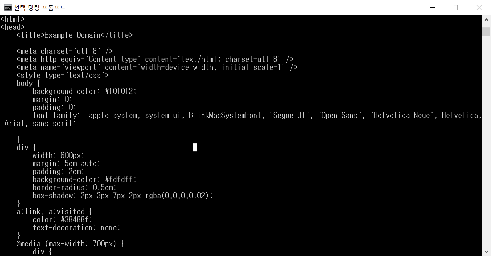

# 하루 1시간 Deno - 1일차(튜토리얼)

Category: #Deno

## 기본 소개

Deno는 V8 엔진을 사용하는 JavaScript와 TypeScript를 위한 간단하고 최신의 안전한 런타임입니다. 또한 Rust로 만들어졌습니다.

- 기본적으로 안전합니다. 명시적으로 적용하지 않으면 파일이나 네트워크, 환경 접근이 없습니다.
- 설치 없이 TypeScript를 지원합니다.
- 실행 파일 하나만을 제공합니다.
- 의존성 탐색기(deno info)나 코드 포매터(deno fmt)와 같은 내장된 유틸리티를 가지고 있습니다.
- Deno를 사용할 때 도움을 줄 수 있는 검증된 표준 모듈들을 가지고 있습니다.

## 설치 방법

많은 설치 방법들이 있지만 플랫폼 별로 1개씩만 썼습니다.

- Windows의 경우(Powershell)

```
iwr https://deno.land/x/install/install.ps1 -useb | iex
```

- Mac의 경우

```
brew install deno
```

## Hello, World!

간단하게 TypeScript 코드를 작성합니다.

```TypeScript
// Hello.ts

import { serve } from "https://deno.land/std@0.83.0/http/server.ts";
const s = serve({ port: 8000 });
console.log("http://localhost:8000/");
for await (const req of s) {
  req.respond({ body: "Hello World\n" });
}
```

코드를 작성한 뒤, 아래 명령어를 실행합니다.

```sh
deno run --allow-net Hello.ts
```

Windows에서 실행했을 때, --allow-net을 사용해야 포트를 열 수 있습니다.(Mac에서는 따로 확인 필요)

이후 http://localhost:8000에 접근하면 Hello World가 노출되는 것을 확인할 수 있습니다.

## 런타임 문서

Deno를 위한 기본적인 런타임 문서는 [doc.deno.land](https://doc.deno.land/builtin/stable)에서 찾을 수 있습니다.

Deno는 런타임의 복잡한 기능들에 대한 자세한 설명들을 [매뉴얼](https://deno.land/manual)에 보여주고 있습니다. Deno가 어떻게 당신의 어플리케이션에 포함되는지, Rust 플러그인을 사용해서 Deno를 확장하는 방법들도 있습니다.

또한 매뉴얼은 Deno가 제공하는 툴들에 대한 정보들도 포함하고 있습니다.

## 첫 걸음(HTTP Request 만들기)

파일을 받아오고, 컨텐츠를 터미널로 출력하는 간단한 웹 서버를 작성해보겠습니다.

브라우저 안에서처럼 HTTP 호출을 만들어주는 `fetch`와 같은 웹 표준 API를 사용할 수 있습니다.

```
const url = Deno.args[0];
const res = await fetch(url);

const body = new Uint8Array(await res.arrayBuffer());
await Deno.stdout.write(body);
```

_이 코드는 https://deno.land/std@0.83.0/examples/curl.ts에도 같은 내용이 있어 명령어에 위 주소를 넣어도 동일하게 동작합니다._

코드를 한 줄씩 파악해보도록 하겠습니다.

1. 어플로 넘어온 첫 번째 argument를 받아서, url 변수에 저장합니다.
2. 저장된 url로 요청을 만들고, 응답을 기다립니다. 그 뒤 응답을 res 변수에 저장합니다.
3. 응답 body를 ArrayBuffer로 파싱을 하고, 결과를 또 기다립니다. 결과는 Uint8Array로 변환되어 body 변수에 저장됩니다.
4. body를 stdout을 통해 컨텐츠를 만들어줍니다.

그 후 다음 명령어를 입력합니다.(위에서 설명했듯 --allow-net 플래그를 추가해줍시다.)

```
deno run --allow-net code.ts https://example.com
```

실행하면 `https://example.com`의 html 코드를 출력하는 것을 볼 수 있습니다.


